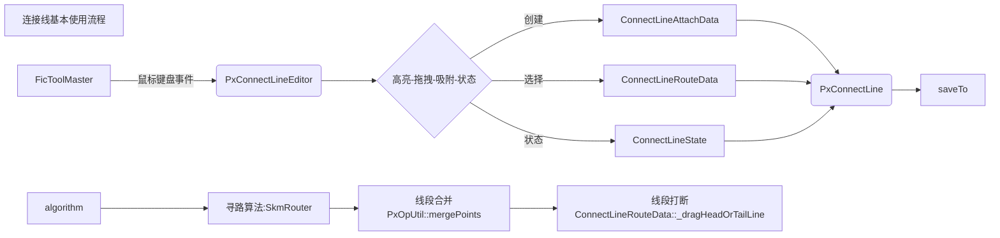
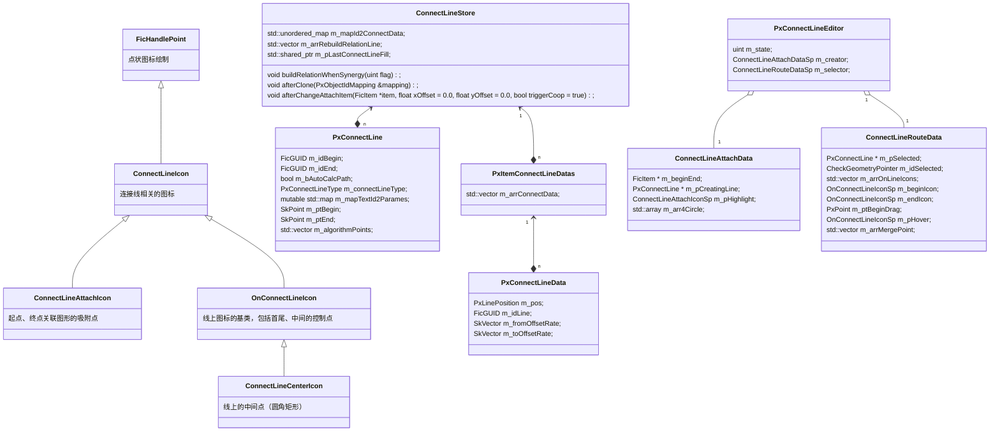

# 连接线
## 基本介绍
- 连接收尾两个图形，并在首尾吸附的图形发生几何变换后，连接线跟随联动 
- 启动连接线编辑模式：快捷键Q，画布内鼠标操作 
- 主要功能：
1. 创建：从图形吸附点开始，从空白处开始
2. 编辑：路径高亮、控制点高亮，拖拽以打断连接线，拖拽以合并连接线，变换吸附图形后联动
3. 样式：填充样式、线宽、线型、两端箭帽、描边样式、顶点、斜度

- 产品文档：https://pre.pixso.cn/app/editor/STKAe_eojwHhyDa2TNT4IA?page-id=728%3A458
- 相关人员：gaoyaokun、zhangshangliang

## 注意
- 从连接线的功能特性出发，它在全局坐标系下工作会很好，因此不允许将连接线设为其它图形的子图形（本质是在几何计算时不想叠加父节点的矩阵），组合除外
- 连接线的线上文本的默认样式不跟随最后一次编辑文本的样式，创建时的字体、字号、填充色固定
- 连接线完全可以脱离基类shape，只是要自己实现两端箭帽的绘制、保存

## 关键点
1. 寻路算法的大致原理，输入什么，输出什么？
> OCR.html、一种基于正交路由的连接线选路算法.doc 
> 输入起点和终点信息、障碍物信息，输出正交点集（不是路径）
2. 如何实现连接线的端部吸附到图形指定的相对位置上？
> 没有用fcPoint（0注释），而是利用向量偏移实现，用中心点到吸附点的向量（带模长）， 除以图形宽、高（为了支持拉伸联动），实现代码：PxConnectLineData::initData、PxConnectLineData::calcPoint
3. 拖动连接线中间控制点时，如何实现线段打断、线段合并？
> 线段合并PxOpUtil::mergePoints，线段打断ConnectLineRouteData::_dragHeadOrTailLine，这里使用了大量的数组索引，请对照图形理解，小心越界
4. 连接线第一版的实现主要有哪些问题，新版做了什么改进？

| 问题 | 改进 |
| :- | :- |
侵入其它UI层代码太严重，整体代码结构导致 | 用PxConnectLineEditor实现连接线的创建、编辑操作，UI层只要启动编辑者、派发鼠标事件即可
对连接线的拖拽等编辑操作的实现不够严谨，出现线段乱飞、点集无限增长等情况 | 实现新的线段打断、线段合并函数
直接对连接线的路径进行序列化，再转换回正交点集， 在拖拽、极小值等特殊情况下无法正确恢复数据，即丢失了原始数据 | 直接序列化正交数据，所有操作都基于对正交点集的修改（存储方式改变需要升级老文档），添加浮点数误差处理

## 待优化
1. 实现完全基于笛卡尔（cartesian）坐标系的坐标系统，相对于父窗口的相对坐标系统，可能是为了迎合渲染层面的需求，但在几何层面，是软件复杂的根源之一
2. 完善UI层的事件分发机制，各个图形提供相应的视图句柄类，独立接收鼠标键盘事件，公共部分放在通用函数或基类中。（可拆卸、组合）
3. 细节：多选时支持自由移除某个图形的凸包或显示，拉伸时支持基于最简单的矩阵的拉伸，其它业务以此为基础等
