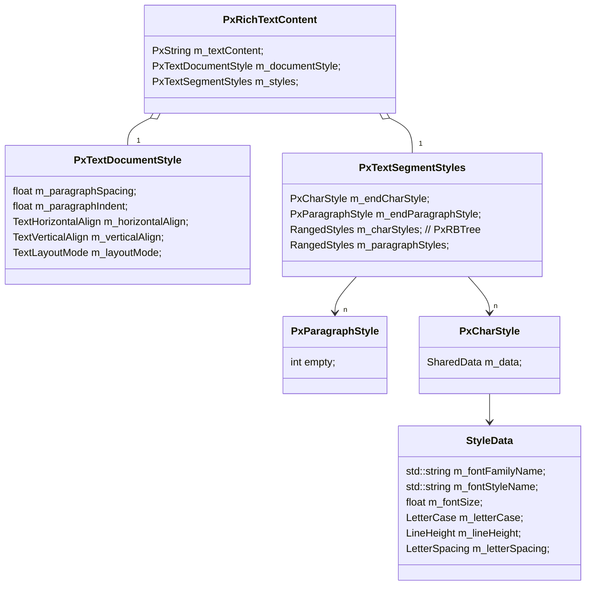

# 文本重构2023
## 背景
1. 文本内存过大导致无法打开大文档
2. 打开文档过程中文本排版耗时过长（多次排版）
>文本样式重复占用内存，在组件实例场景下尤其明显

## 核心类图

## 参考资料
>[红黑树实现细节](https://www.cnblogs.com/skywang12345/p/3245399.html)
>[红黑树实现细节2](https://www.cnblogs.com/skywang12345/p/3624291.html)

### 讨论
>2023-01-30
>1. PxParagraphStyle没有和文档的kiwi结构对应，意味着刷新文档后，里面的数据将丢失
>2. 在整个文档范围内共享文本样式，大部分情况下样式都相同

