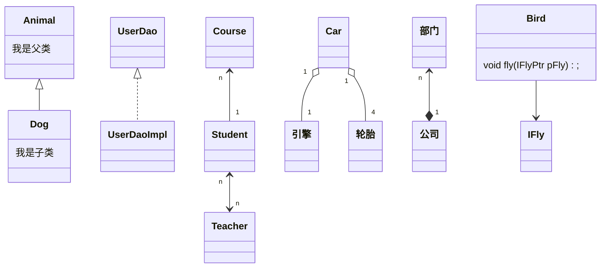

# 以文本形式绘制类图（markdown + mermaid）

## [MarkDown]()
>Markdown是一种轻量级的标记语言，可用于将格式设置元素添加到纯文本文档中。Markdown 由John Gruber于2004年创建，如今已成为世界上最受欢迎的标记语言之一。

## [Mermaid](https://mermaid.js.org/syntax/classDiagram.html)
>Mermaid 是一种基于 JavaScript 的图表绘制工具，它使用受 Markdown 启发的文本定义和渲染器来创建和修改复杂的图表。 Mermaid 的主要目的是帮助文档跟上开发的步伐，允许您使用文本和代码创建图表和可视化

## [UML中六种类与类之间的关系](https://www.ibm.com/docs/zh/rsm/7.5.0?topic=diagrams-relationships-in-class)
>泛化（Generalization）、实现（Realization）、关联（Association）、聚合（Aggregation）、组合（Composition）、依赖（Dependency）
> [强弱程度依次为：泛化 = 实现 > 组合 > 聚合 > 关联 > 依赖](https://blog.csdn.net/cat_hate_fish/article/details/116332948)

| 名称 | 说明 |
| :----| :---- |
[泛化](https://www.ibm.com/docs/zh/rsm/7.5.0?topic=diagrams-generalization-relationships) | 一个类（子类、子接口）继承另外的一个类（父类、父接口）的功能，并可以增加它自己的新功能的能力
[实现](https://www.ibm.com/docs/zh/rsm/7.5.0?topic=diagrams-interface-realization-relationships) | 一个class类实现interface接口（可以是多个）的功能
[关联](https://www.ibm.com/docs/zh/rsm/7.5.0?topic=diagrams-association-classes) | 两个类、或者类与接口之间语义级别的一种强依赖关系，它使一个类知道另一个类的属性和方法；如：老师与学生。表现在代码层面，为被关联类B以类属性的形式出现在关联类A中，也可能是关联类A引用了一个类型为被关联类B的全局变量
[聚合](https://www.ibm.com/docs/zh/rsm/7.5.0?topic=diagrams-aggregation-relationships) | 聚合是关联关系的一种特例，他体现的是整体与部分、拥有的关系，即has-a的关系，此时整体与部分之间是可分离的，他们可以具有各自的生命周期，部分可以属于多个整体对象，也可以为多个整体对象共享；比如计算机与CPU、公司与员工的关系等；表现在代码层面，和关联关系是一致的，只能从语义级别来区分；
[组合](https://www.ibm.com/docs/zh/rsm/7.5.0?topic=diagrams-composition-association-relationships) | 组合也是关联关系的一种特例，他体现的是一种contains-a的关系，这种关系比聚合更强，也称为强聚合；他同样体现整体与部分间的关系，但此时整体与部分是不可分的，整体的生命周期结束也就意味着部分的生命周期结束；比如你和你的大脑；表现在代码层面，和关联关系是一致的，只能从语义级别来区分；
[依赖](https://www.ibm.com/docs/zh/rsm/7.5.0?topic=diagrams-dependency-relationships) | 是一种使用的关系，即一个类的实现需要另一个类的协助，表现在代码层面：类A在某个方法中使用类B作为参数、属性

